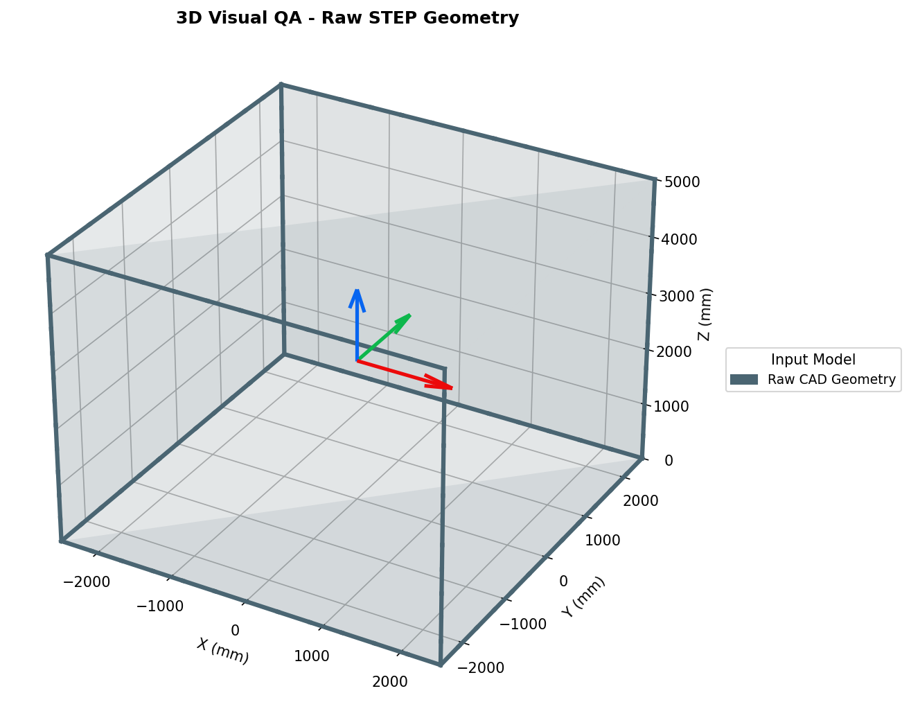
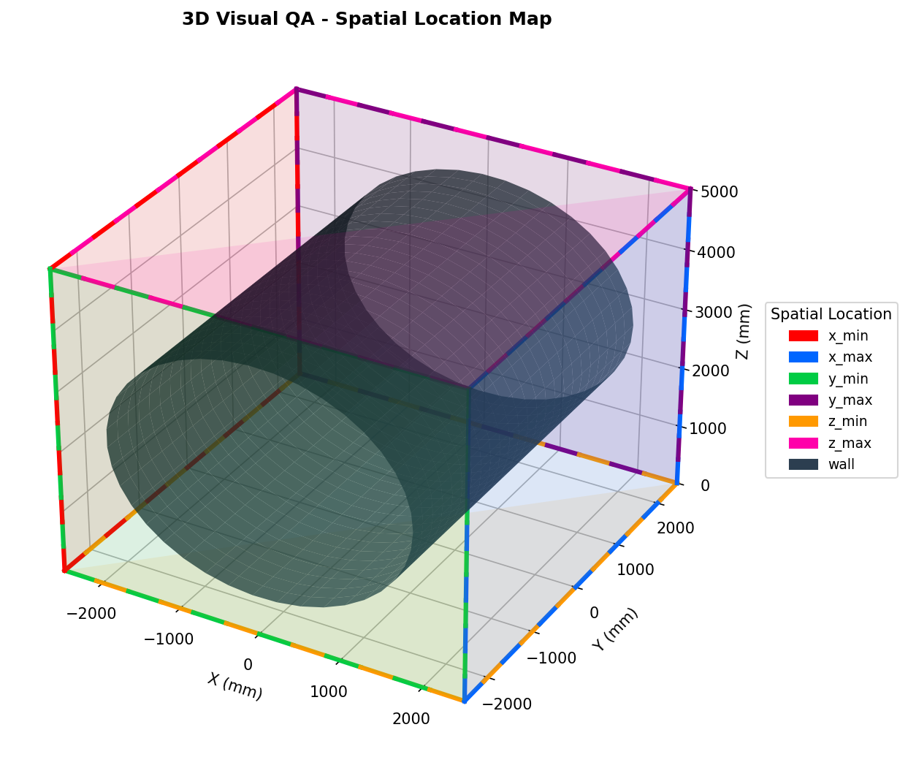
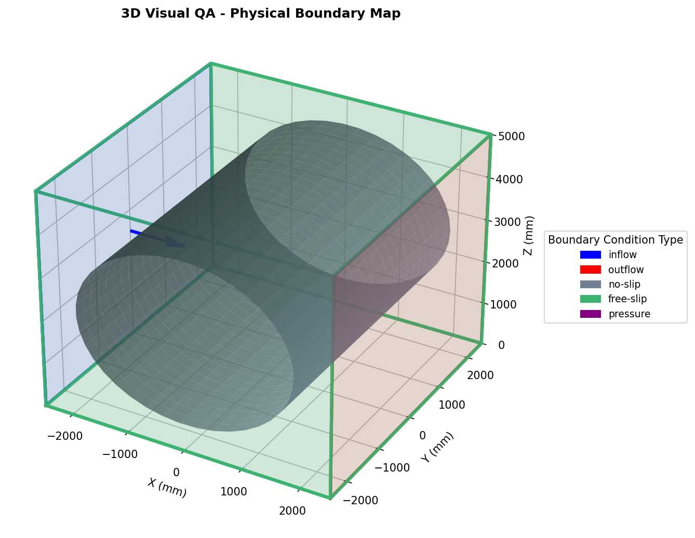

# 📐 CFD Compiler

## 🧩 CAD → Spatial Location → Physical Boundary Pipeline
A high‑fidelity scientific CFD compiler designed for CAD/STEP geometries, 
spatial location mapping, physical boundary parsing, and solver preprocessing.

### 🖼️ Pipeline Preview (STEP → Spatial Location → Physical Boundary)

<table align="center" style="border: 1px solid white; border-collapse: collapse; background: transparent;">
  <tr>
    <td style="border: 1px solid white; text-align: center; vertical-align: middle; padding: 0 8px; background: transparent;">
      
    </td>
    <td style="border: 1px solid white; text-align: center; vertical-align: middle; padding: 0 12px; font-size: 32px; color: #666; background: transparent;">
      &rarr;
    </td>
    <td style="border: 1px solid white; text-align: center; vertical-align: middle; padding: 0 8px; background: transparent;">
      
    </td>
    <td style="border: 1px solid white; text-align: center; vertical-align: middle; padding: 0 12px; font-size: 32px; color: #666; background: transparent;">
      &rarr;
    </td>
    <td style="border: 1px solid white; text-align: center; vertical-align: middle; padding: 0 8px; background: transparent;">
      
    </td>
  </tr>
</table>

### 📚 Resources & Documentation
- **Tutorial/Book:** ***currently in development***

---

### 🧮 Performance Audit:
### Audit: 2026-07-28 15:05:23 UTC
- **Branch:** `main`
- **Status:** `success`
- **Run:** [Detailed Execution Logs](https://github.com/Dmitrii-Zavalin-Deployments/cfd_compiler/actions/runs/30371192814)
- **CPU Load:** `26.2%`
- **Memory Usage:** `180/15989MB`
### Audit: 2026-07-28 14:53:54 UTC
- **Branch:** `main`
- **Status:** `success`
- **Run:** [Detailed Execution Logs](https://github.com/Dmitrii-Zavalin-Deployments/cfd_compiler/actions/runs/30370198986)
- **CPU Load:** `26.7%`
- **Memory Usage:** `180/15989MB`
### Audit: 2026-07-28 14:47:41 UTC
- **Branch:** `main`
- **Status:** `success`
- **Run:** [Detailed Execution Logs](https://github.com/Dmitrii-Zavalin-Deployments/cfd_compiler/actions/runs/30369661542)
- **CPU Load:** `26.2%`
- **Memory Usage:** `180/15989MB`
### Audit: 2026-07-28 14:30:36 UTC
- **Branch:** `main`
- **Status:** `success`
- **Run:** [Detailed Execution Logs](https://github.com/Dmitrii-Zavalin-Deployments/cfd_compiler/actions/runs/30368250291)
- **CPU Load:** `24.4%`
- **Memory Usage:** `180/15989MB`
### Audit: 2026-07-28 11:49:31 UTC
- **Branch:** `main`
- **Status:** `success`
- **Run:** [Detailed Execution Logs](https://github.com/Dmitrii-Zavalin-Deployments/cfd_compiler/actions/runs/30355987636)
- **CPU Load:** `26.2%`
- **Memory Usage:** `180/15993MB`
### Audit: 2026-07-27 18:13:59 UTC
- **Branch:** `main`
- **Status:** `success`
- **Run:** [Detailed Execution Logs](https://github.com/Dmitrii-Zavalin-Deployments/cfd_compiler/actions/runs/30292479828)
- **CPU Load:** `31%`
- **Memory Usage:** `180/15989MB`
### Audit: 2026-07-27 14:35:20 UTC
- **Branch:** `main`
- **Status:** `success`
- **Run:** [Detailed Execution Logs](https://github.com/Dmitrii-Zavalin-Deployments/cfd_compiler/actions/runs/30275375175)
- **CPU Load:** `26.2%`
- **Memory Usage:** `181/15989MB`
### Audit: 2026-07-27 14:28:45 UTC
- **Branch:** `main`
- **Status:** `success`
- **Run:** [Detailed Execution Logs](https://github.com/Dmitrii-Zavalin-Deployments/cfd_compiler/actions/runs/30274872896)
- **CPU Load:** `26.2%`
- **Memory Usage:** `180/15989MB`
### Audit: 2026-07-27 14:25:02 UTC
- **Branch:** `main`
- **Status:** `success`
- **Run:** [Detailed Execution Logs](https://github.com/Dmitrii-Zavalin-Deployments/cfd_compiler/actions/runs/30274498036)
- **CPU Load:** `27.3%`
- **Memory Usage:** `180/15989MB`
### Audit: 2026-07-27 13:24:07 UTC
- **Branch:** `main`
- **Status:** `success`
- **Run:** [Detailed Execution Logs](https://github.com/Dmitrii-Zavalin-Deployments/cfd_compiler/actions/runs/30269617231)
- **CPU Load:** `26.8%`
- **Memory Usage:** `181/15988MB`
### Audit: 2026-07-26 19:48:31 UTC
- **Branch:** `main`
- **Status:** `success`
- **Run:** [Detailed Execution Logs](https://github.com/Dmitrii-Zavalin-Deployments/cfd_compiler/actions/runs/30217541031)
- **CPU Load:** `26.2%`
- **Memory Usage:** `181/15993MB`
### Audit: 2026-07-26 19:43:15 UTC
- **Branch:** `main`
- **Status:** `success`
- **Run:** [Detailed Execution Logs](https://github.com/Dmitrii-Zavalin-Deployments/cfd_compiler/actions/runs/30217358358)
- **CPU Load:** `26.2%`
- **Memory Usage:** `181/15989MB`
### Audit: 2026-07-26 19:30:12 UTC
- **Branch:** `main`
- **Status:** `success`
- **Run:** [Detailed Execution Logs](https://github.com/Dmitrii-Zavalin-Deployments/cfd_compiler/actions/runs/30216922868)
- **CPU Load:** `2.3%`
- **Memory Usage:** `172/15989MB`
### Audit: 2026-07-26 19:25:09 UTC
- **Branch:** `main`
- **Status:** `failure`
- **Run:** [Detailed Execution Logs](https://github.com/Dmitrii-Zavalin-Deployments/cfd_compiler/actions/runs/30216717448)
- **CPU Load:** `0%`
- **Memory Usage:** `1198/15989MB`
### Audit: 2026-07-26 19:17:42 UTC
- **Branch:** `main`
- **Status:** `failure`
- **Run:** [Detailed Execution Logs](https://github.com/Dmitrii-Zavalin-Deployments/cfd_compiler/actions/runs/30216458610)
- **CPU Load:** `4.8%`
- **Memory Usage:** `1142/15989MB`
### Audit: 2026-07-26 18:48:09 UTC
- **Branch:** `main`
- **Status:** `failure`
- **Run:** [Detailed Execution Logs](https://github.com/Dmitrii-Zavalin-Deployments/cfd_compiler/actions/runs/30215396493)
- **CPU Load:** `2.3%`
- **Memory Usage:** `1198/15993MB`
### Audit: 2026-07-26 18:41:55 UTC
- **Branch:** `main`
- **Status:** `failure`
- **Run:** [Detailed Execution Logs](https://github.com/Dmitrii-Zavalin-Deployments/cfd_compiler/actions/runs/30215188840)
- **CPU Load:** `0%`
- **Memory Usage:** `1327/15988MB`
### Audit: 2026-07-26 18:17:53 UTC
- **Branch:** `main`
- **Status:** `failure`
- **Run:** [Detailed Execution Logs](https://github.com/Dmitrii-Zavalin-Deployments/cfd_compiler/actions/runs/30214324643)
- **CPU Load:** `2.4%`
- **Memory Usage:** `1305/15989MB`
### Audit: 2026-07-26 17:53:09 UTC
- **Branch:** `main`
- **Status:** `success`
- **Run:** [Detailed Execution Logs](https://github.com/Dmitrii-Zavalin-Deployments/cfd_compiler/actions/runs/30213431663)
- **CPU Load:** `2.4%`
- **Memory Usage:** `173/15988MB`
### Audit: 2026-07-26 15:58:51 UTC
- **Branch:** `main`
- **Status:** `success`
- **Run:** [Detailed Execution Logs](https://github.com/Dmitrii-Zavalin-Deployments/cfd_compiler/actions/runs/30209284207)
- **CPU Load:** `24.4%`
- **Memory Usage:** `172/15989MB`
### Audit: 2026-07-26 15:54:08 UTC
- **Branch:** `main`
- **Status:** `success`
- **Run:** [Detailed Execution Logs](https://github.com/Dmitrii-Zavalin-Deployments/cfd_compiler/actions/runs/30209096502)
- **CPU Load:** `27.9%`
- **Memory Usage:** `172/15989MB`
### Audit: 2026-07-26 15:45:12 UTC
- **Branch:** `main`
- **Status:** `success`
- **Run:** [Detailed Execution Logs](https://github.com/Dmitrii-Zavalin-Deployments/cfd_compiler/actions/runs/30208772295)
- **CPU Load:** `27.9%`
- **Memory Usage:** `175/15989MB`
### Audit: 2026-07-26 15:35:00 UTC
- **Branch:** `main`
- **Status:** `success`
- **Run:** [Detailed Execution Logs](https://github.com/Dmitrii-Zavalin-Deployments/cfd_compiler/actions/runs/30208420708)
- **CPU Load:** `26.2%`
- **Memory Usage:** `174/15989MB`
### Audit: 2026-07-26 15:21:37 UTC
- **Branch:** `main`
- **Status:** `success`
- **Run:** [Detailed Execution Logs](https://github.com/Dmitrii-Zavalin-Deployments/cfd_compiler/actions/runs/30207944421)
- **CPU Load:** `52.4%`
- **Memory Usage:** `173/15989MB`
### Audit: 2026-07-26 15:06:32 UTC
- **Branch:** `main`
- **Status:** `success`
- **Run:** [Detailed Execution Logs](https://github.com/Dmitrii-Zavalin-Deployments/cfd_compiler/actions/runs/30207409699)
- **CPU Load:** `26.2%`
- **Memory Usage:** `173/15989MB`
### Audit: 2026-07-26 15:00:19 UTC
- **Branch:** `main`
- **Status:** `failure`
- **Run:** [Detailed Execution Logs](https://github.com/Dmitrii-Zavalin-Deployments/cfd_compiler/actions/runs/30207184733)
- **CPU Load:** `29.3%`
- **Memory Usage:** `173/15989MB`
### Audit: 2026-07-26 14:53:37 UTC
- **Branch:** `main`
- **Status:** `success`
- **Run:** [Detailed Execution Logs](https://github.com/Dmitrii-Zavalin-Deployments/cfd_compiler/actions/runs/30206934017)
- **CPU Load:** `23.8%`
- **Memory Usage:** `172/15989MB`
### Audit: 2026-07-26 14:48:02 UTC
- **Branch:** `main`
- **Status:** `failure`
- **Run:** [Detailed Execution Logs](https://github.com/Dmitrii-Zavalin-Deployments/cfd_compiler/actions/runs/30206768400)
- **CPU Load:** `2.1%`
- **Memory Usage:** `1304/15989MB`
### Audit: 2026-07-26 14:41:19 UTC
- **Branch:** `main`
- **Status:** `success`
- **Run:** [Detailed Execution Logs](https://github.com/Dmitrii-Zavalin-Deployments/cfd_compiler/actions/runs/30206502645)
- **CPU Load:** `2.4%`
- **Memory Usage:** `173/15989MB`
### Audit: 2026-07-26 14:35:32 UTC
- **Branch:** `main`
- **Status:** `failure`
- **Run:** [Detailed Execution Logs](https://github.com/Dmitrii-Zavalin-Deployments/cfd_compiler/actions/runs/30206291288)
- **CPU Load:** `2.3%`
- **Memory Usage:** `1174/15989MB`
### Audit: 2026-07-26 14:26:41 UTC
- **Branch:** `main`
- **Status:** `failure`
- **Run:** [Detailed Execution Logs](https://github.com/Dmitrii-Zavalin-Deployments/cfd_compiler/actions/runs/30205988668)
- **CPU Load:** `2.4%`
- **Memory Usage:** `1172/15989MB`
### Audit: 2026-07-26 14:16:56 UTC
- **Branch:** `main`
- **Status:** `success`
- **Run:** [Detailed Execution Logs](https://github.com/Dmitrii-Zavalin-Deployments/cfd_compiler/actions/runs/30205655449)
- **CPU Load:** `26.8%`
- **Memory Usage:** `173/15989MB`
### Audit: 2026-07-26 13:46:26 UTC
- **Branch:** `main`
- **Status:** `success`
- **Run:** [Detailed Execution Logs](https://github.com/Dmitrii-Zavalin-Deployments/cfd_compiler/actions/runs/30204630647)
- **CPU Load:** `27.9%`
- **Memory Usage:** `172/15989MB`
### Audit: 2026-07-26 13:30:08 UTC
- **Branch:** `main`
- **Status:** `failure`
- **Run:** [Detailed Execution Logs](https://github.com/Dmitrii-Zavalin-Deployments/cfd_compiler/actions/runs/30204076485)
- **CPU Load:** `2.4%`
- **Memory Usage:** `1442/15989MB`
### Audit: 2026-07-26 13:11:45 UTC
- **Branch:** `main`
- **Status:** `failure`
- **Run:** [Detailed Execution Logs](https://github.com/Dmitrii-Zavalin-Deployments/cfd_compiler/actions/runs/30203445403)
- **CPU Load:** `4.6%`
- **Memory Usage:** `1187/15993MB`
### Audit: 2026-07-26 12:47:16 UTC
- **Branch:** `main`
- **Status:** `failure`
- **Run:** [Detailed Execution Logs](https://github.com/Dmitrii-Zavalin-Deployments/cfd_compiler/actions/runs/30202643836)
- **CPU Load:** `0%`
- **Memory Usage:** `1251/15989MB`
### Audit: 2026-07-26 11:16:29 UTC
- **Branch:** `main`
- **Status:** `failure`
- **Run:** [Detailed Execution Logs](https://github.com/Dmitrii-Zavalin-Deployments/cfd_compiler/actions/runs/30199731443)
- **CPU Load:** `2.4%`
- **Memory Usage:** `1196/15988MB`
### Audit: 2026-07-26 10:46:57 UTC
- **Branch:** `main`
- **Status:** `failure`
- **Run:** [Detailed Execution Logs](https://github.com/Dmitrii-Zavalin-Deployments/cfd_compiler/actions/runs/30198792248)
- **CPU Load:** `2.4%`
- **Memory Usage:** `1138/15989MB`
### Audit: 2026-07-26 04:17:20 UTC
- **Branch:** `main`
- **Status:** `failure`
- **Run:** [Detailed Execution Logs](https://github.com/Dmitrii-Zavalin-Deployments/cfd_compiler/actions/runs/30187452673)
- **CPU Load:** `2.4%`
- **Memory Usage:** `1233/15989MB`
### Audit: 2026-07-26 03:47:07 UTC
- **Branch:** `main`
- **Status:** `failure`
- **Run:** [Detailed Execution Logs](https://github.com/Dmitrii-Zavalin-Deployments/cfd_compiler/actions/runs/30186633414)
- **CPU Load:** `0%`
- **Memory Usage:** `1300/15993MB`
### Audit: 2026-07-25 19:46:17 UTC
- **Branch:** `main`
- **Status:** `failure`
- **Run:** [Detailed Execution Logs](https://github.com/Dmitrii-Zavalin-Deployments/cfd_compiler/actions/runs/30172192826)
- **CPU Load:** `0%`
- **Memory Usage:** `1299/15993MB`
### Audit: 2026-07-25 19:15:54 UTC
- **Branch:** `main`
- **Status:** `failure`
- **Run:** [Detailed Execution Logs](https://github.com/Dmitrii-Zavalin-Deployments/cfd_compiler/actions/runs/30171196607)
- **CPU Load:** `4.6%`
- **Memory Usage:** `1260/15989MB`
### Audit: 2026-07-25 18:46:39 UTC
- **Branch:** `main`
- **Status:** `success`
- **Run:** [Detailed Execution Logs](https://github.com/Dmitrii-Zavalin-Deployments/cfd_compiler/actions/runs/30170227896)
- **CPU Load:** `26.2%`
- **Memory Usage:** `169/15989MB`
### Audit: 2026-07-25 17:24:31 UTC
- **Branch:** `main`
- **Status:** `success`
- **Run:** [Detailed Execution Logs](https://github.com/Dmitrii-Zavalin-Deployments/cfd_compiler/actions/runs/30167477606)
- **CPU Load:** `24.4%`
- **Memory Usage:** `169/15993MB`
### Audit: 2026-07-25 17:18:58 UTC
- **Branch:** `main`
- **Status:** `success`
- **Run:** [Detailed Execution Logs](https://github.com/Dmitrii-Zavalin-Deployments/cfd_compiler/actions/runs/30167309937)
- **CPU Load:** `27.9%`
- **Memory Usage:** `164/15989MB`
### Audit: 2026-07-25 17:15:51 UTC
- **Branch:** `main`
- **Status:** `success`
- **Run:** [Detailed Execution Logs](https://github.com/Dmitrii-Zavalin-Deployments/cfd_compiler/actions/runs/30167214174)
- **CPU Load:** `2.4%`
- **Memory Usage:** `159/15989MB`
### Audit: 2026-07-25 16:48:56 UTC
- **Branch:** `main`
- **Status:** `success`
- **Run:** [Detailed Execution Logs](https://github.com/Dmitrii-Zavalin-Deployments/cfd_compiler/actions/runs/30166312401)
- **CPU Load:** `20%`
- **Memory Usage:** `159/15988MB`
### Audit: 2026-07-25 16:05:46 UTC
- **Branch:** `main`
- **Status:** `success`
- **Run:** [Detailed Execution Logs](https://github.com/Dmitrii-Zavalin-Deployments/cfd_compiler/actions/runs/30164713539)
- **CPU Load:** `52.4%`
- **Memory Usage:** `159/15989MB`
